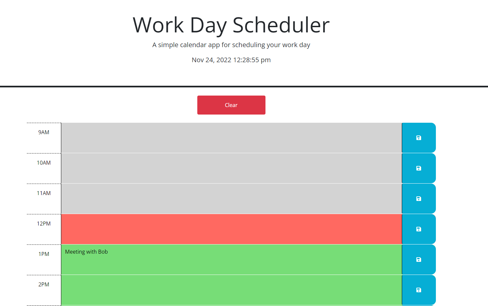

# Work-Day-Planner

## Description

This project is a simple work day planner, that uses the Day.js API to return your computers current time and date, the current hour will change the 9 to 5 time blocks color accordingly. Gray is past , Red is current hour , Green is future 

## Usage
Link to view my site - https://ryguy506.github.io/Work-Day-Planner/

Click on a time block and type in your task, then click the save button to save your task to local storage. The tasks will remain on the page even after closing or refreshing the page.

## License

Free to use
